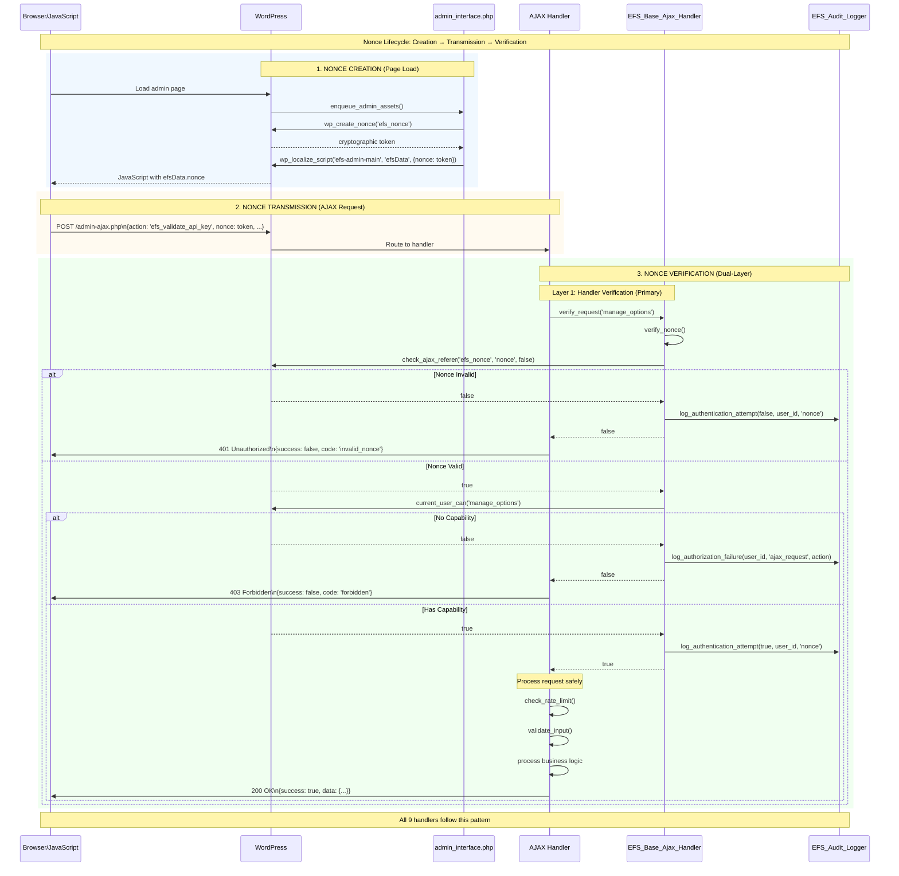

# Etch Fusion Suite Nonce Strategy

**Created:** 2025-10-28 17:48

## 1. Overview

WordPress nonces ("number used once") are single-use tokens that protect authenticated actions against Cross-Site Request Forgery (CSRF). Etch Fusion Suite implements a **centralized nonce architecture** anchored to the `'efs_nonce'` action across every AJAX request. A shared nonce token simplifies management, ensures consistent verification, and reduces frontend complexity while still enforcing granular authorization through capability checks and rate limiting.

## 2. Nonce Lifecycle

### 2.1 Nonce Creation

- Source: `includes/admin_interface.php::enqueue_admin_assets()` @89-96
- The admin interface generates a nonce via `wp_create_nonce( 'efs_nonce' )`
- The token is delivered to JavaScript through `wp_localize_script( 'efs-admin-main', 'efsData', [ 'nonce' => $token ] )`
- `wp_localize_script()` escapes values automatically so the nonce is safe for inline output in the admin bundle

### 2.2 Nonce Transmission

- Admin JavaScript includes the nonce with every AJAX payload in a POST field named `nonce`
- The pattern is enforced in `assets/js/admin/main.js` and reused by shared request helpers
- All AJAX endpoints expect the nonce alongside the `action` parameter, regardless of business logic

### 2.3 Nonce Verification (Dual-Layer)

#### Layer 1: Admin Interface Pre-Verification

- Source: `includes/admin_interface.php::get_request_payload()` @144-169
- `check_ajax_referer( 'efs_nonce', 'nonce', false )` verifies the nonce before payload sanitization
- `$die = false` allows the admin interface to return structured JSON errors instead of triggering WordPress' default `die()` behaviour
- Legacy actions (`efs_save_settings`, `efs_test_connection`) benefit from this guard even before the request reaches a handler class

#### Layer 2: Handler Verification (Primary)

- Source: `includes/ajax/class-base-ajax-handler.php::verify_request()` @119-158
- Security model:
  1. **Nonce verification** — `verify_nonce()` delegates to `check_ajax_referer( $this->nonce_action, $this->nonce_field, false )`
  2. **Capability check** — `check_capability()` enforces `current_user_can( 'manage_options' )`
  3. **Audit logging** — `audit_logger->log_authentication_attempt()` records success/failure with severity metadata
- Default properties: `$nonce_action = 'efs_nonce'` @23 and `$nonce_field = 'nonce'` @28
- Handlers stop processing immediately when `verify_request()` fails; the base class emits the JSON error response

## 3. Implementation Pattern

### 3.1 Handler Skeleton

```php
public function handler_method() {
    if ( ! $this->verify_request( 'manage_options' ) ) {
        return; // JSON error already returned
    }

    if ( ! $this->check_rate_limit( 'action_name', 30, 60 ) ) {
        return; // Rate limit JSON error already returned
    }

    $validated = $this->validate_input( $data, $rules );

    // Business logic ...

    wp_send_json_success( $result );
}
```

### 3.2 Handler Coverage (9/9)

All handlers extend `EFS_Base_Ajax_Handler` and invoke `verify_request()` as the first executable line:

- `includes/ajax/handlers/class-validation-ajax.php` — `efs_validate_api_key`, `efs_validate_migration_token`
- `includes/ajax/handlers/class-connection-ajax.php` — `efs_test_export_connection`, `efs_test_import_connection`
- `includes/ajax/handlers/class-migration-ajax.php` — `efs_start_migration`, `efs_get_migration_progress`, `efs_migrate_batch`, `efs_cancel_migration`, `efs_generate_report`, `efs_generate_migration_key`
- `includes/ajax/handlers/class-cleanup-ajax.php` — `efs_cleanup_etch`
- `includes/ajax/handlers/class-logs-ajax.php` — `efs_clear_logs`, `efs_get_logs`
- `includes/ajax/handlers/class-css-ajax.php` — `efs_migrate_css`, `efs_convert_css`, `efs_get_global_styles`
- `includes/ajax/handlers/class-media-ajax.php` — `efs_migrate_media`
- `includes/ajax/handlers/class-content-ajax.php` — `efs_migrate_batch`, `efs_get_bricks_posts`
- `includes/ajax/handlers/class-template-ajax.php` — `efs_extract_template`, `efs_get_extraction_progress`, `efs_save_template`, `efs_get_saved_templates`, `efs_delete_template`

## 4. Security Considerations

### 4.1 Single Nonce Action

- Centralizes nonce management in PHP and JavaScript
- Eliminates the need to juggle multiple nonce tokens client-side
- Capability checks (`manage_options`) ensure action-level authorization
- Rate limiting adds a second throttle for brute-force attempts

### 4.2 Nonce Expiration

- WordPress nonces expire after 24 hours by default
- Users encountering an expired nonce receive: "The request could not be authenticated. Please refresh the page and try again."
- Refreshing the admin page generates a fresh token automatically

### 4.3 CSRF Protection

- Tokens cannot be forged by third parties without access to the admin session
- Dual-layer verification (admin interface + handlers) guards against edge cases where legacy endpoints bypass the base handler
- Capability checks and audit logs provide a documented trail for security reviews

## 5. Error Handling

### 5.1 Invalid Nonce

- HTTP status: `401 Unauthorized`
- JSON: `{ "success": false, "data": { "message": "The request could not be authenticated. Please refresh the page and try again.", "code": "invalid_nonce" } }`
- Audit log: `auth_failure` event with severity `medium`

### 5.2 Missing Capability

- HTTP status: `403 Forbidden`
- JSON: `{ "success": false, "data": { "message": "You do not have permission to perform this action.", "code": "forbidden" } }`
- Audit log: `authorization_failure` event with severity `medium`

## 6. Testing Nonce Verification

### 6.1 Manual Testing

- Invalid nonce → expect `401` with `invalid_nonce`
- Expired nonce → expect `401` with `invalid_nonce`
- Missing nonce → expect `401` with `invalid_nonce`
- Valid nonce, missing capability → expect `403` with `forbidden`

### 6.2 Automated Testing

- PHPUnit coverage can target `EFS_Base_Ajax_Handler::verify_request()` using mocked `wp_send_json_*` helpers
- Ensure future test suites simulate nonce failures and capability denials

## 7. PHPCS Compliance

- `EFS_Base_Ajax_Handler::get_post()` @165-200 includes documented `phpcs:ignore WordPress.Security.NonceVerification.Missing`
- Justification: the method is only reachable after `verify_request()` succeeds
- `docs/phpcs-manual-fixes-backlog.md` confirms zero outstanding violations for nonce checks

## 8. Mermaid Diagram



## 9. References

- `includes/ajax/class-base-ajax-handler.php` @18-571
- `includes/admin_interface.php` @19-210
- `docs/security-architecture.md`
- `docs/security-best-practices.md`
- `docs/security-verification-checklist.md`
- WordPress Developer Resources: [`wp_create_nonce()`](https://developer.wordpress.org/reference/functions/wp_create_nonce/), [`check_ajax_referer()`](https://developer.wordpress.org/reference/functions/check_ajax_referer/)
